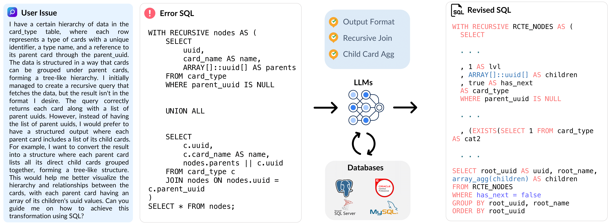

# BIRD-CRITIC 1.0 (SQL)   

<p align="center">
  
</p>


<div style="display: flex; justify-content: center; align-items: center; gap: 10px;">
  <a href="https://creativecommons.org/licenses/by-sa/4.0/deed.en">
    
  </a>
  <a href="https://bird-critic.github.io/">
    
  </a>
  <a href="https://huggingface.co/datasets/birdsql/bird-critic-1.0-flash-exp/">
    
  </a>
  <a href="https://www.python.org/downloads/release/python-310/">
    
  </a>
  <a href="https://pypi.org/project/openai/">
    
  </a>
</div>

## News

- 📢 **[2025-07-09]** We release the human performance scores on our [**website**](https://bird-critic.github.io/)! The scores displayed across all three leaderboards reflect human evaluators (database experts) who were allowed to use standard tools (database textbooks, official documentation, or IDEs) but not AI assistants. When another group with the same expertise was permitted to use AI tools (ChatGPT, Claude, or Gemini), the performance increased to **83.33** on Open, **87.90** on PG, and **90.00** on Flash, demonstrating the significant potential of human-AI collaboration in SQL problem-solving.
- 📢 **[2025-06-28]** We release our paper [**SWE-SQL** (a.k.a BIRD-CRITIC)](https://arxiv.org/abs/2506.18951) on arxiv. 
- 📢 **[2025-06-09]** We release [**bird-interact-lite**](https://huggingface.co/datasets/birdsql/bird-interact-lite), feature multi-turn conversational and agentic interaction for real-world ambiguous and challenging text-to-SQL tasks. 
- 📢 **[2025-06-08]** We release [**bird-critic-1.0-postgresql**](https://huggingface.co/datasets/birdsql/bird-critic-1.0-postgresql), a single-dialect SQL issue debugging set with 530 complex tasks. 
- 📢 **[2025-05-30]** We are pleased to release [**LiveSQLBench-Base-Lite**](https://huggingface.co/datasets/birdsql/livesqlbench-base-lite), featuring 18 end-user level databases and 270 tasks (180 SELECT-only, 90 Management tasks). Each task involves unambiguous and straightforward user queries grounded in external knowledge, with medium to hard complexity SQL statements.


## 🧸 Overview

BIRD-Critic 1.0 introduces a novel SQL benchmark designed to evaluate a key capability: **Can large language models (LLMs) diagnose and solve user issues within real-world database environments?**

The benchmark comprises 600 tasks for development and 200 held-out out-of-distribution (OOD) tests. BIRD-CRITIC 1.0 is built on realistic user issues across 4 prominent open-source SQL dialects: MySQL, PostgreSQL, SQL Server, and Oracle. It expands beyond simple SELECT queries to cover a wider range of SQL operations, reflecting actual application scenarios. Finally, an optimized execution-based evaluation environment is included for rigorous and efficient validation.

<p align="center">
  
</p>

### ✅ Verification Process

Each task in BIRD-CRITIC has been verified by human experts on the following dimensions:

1) Reproduction of errors on the BIRD environment to prevent data leakage.
2) Carefully curated test case functions for each task specifically.
   - **Soft EX**: This metric can evaluate SELECT-ONLY tasks.
   - **Soft EX + Parsing**: This metric can evaluate tasks with user-specific requirements or refinements.
   - **Test Case**: For DBA tasks, such as CRUD (CREATE, READ, UPDATE, DELETE), test cases are designed to evaluate the correctness of the logic. This is also effective for user issues requiring multiple sequential SQL queries to resolve.
   - **Query Execution Plan**: For user tasks involving efficiency improvement or runtime errors, QEP (Query Execution Plan) can be used to evaluate solution SQL queries at the algorithm level.
3) Fast Eval Sandbox via PostgreSQL template & docker.
4) Created new RDBs in different scales and professional domains.


### 🐣 Lite Version

We are releasing a lite version of BIRD-Critic, `bird-critic-1.0-flash-exp`, which includes 200 high-quality user issues on PostgreSQL when developing real-world applications. We curate tasks by:
- Collecting and understanding realistic user issues.
- Distilling problem definitions and SQL knowledge.
- Reproducing bugs and solutions in the BIRD environment.
- Designing test cases for evaluation.

### 🦜 Open Version

The open version of BIRD-CRITIC 1.0, `bird-critic-1.0-open`, is a comprehensive benchmark that includes 600 tasks across 4 SQL dialects: MySQL, PostgreSQL, SQL Server, and Oracle. It covers a wide range of SQL operations and user issues.


### Model Performance Results on BIRD-CRITIC 1.0 Open

| Rank | Model Name | Score | Level |
|------|------------|-------|-----------|
| 1 | o3-mini-2025-01-31  | **34.50** | 🏆 Leading |
| 2 | deepseek-reasoner (r1) | 33.67 | 🌟 Elite |
| 3 | o1-preview-2024-09-12 | 33.33 | 🌟 Elite |
| 4 | claude-3-7-sonnet-20250219(thinking) | 30.67 | 🌟 Elite |
| 5 |gemini-2.0-flash-thinking-exp-01-21 | 30.17 | 🌟 Elite|
| 6 | grok-3-beta | 29.83 | 💎 Superior |

> Complete results of Open version can be found [here](https://huggingface.co/datasets/birdsql/bird-critic-1.0-open).
> Bird-CRITIC 1.0 Flash result can be found [here](https://huggingface.co/datasets/birdsql/bird-critic-1.0-flash-exp/)

## 🦅 Full Sets of BIRD-CRITIC 1.0

The BIRD-CRITIC 1.0 benchmark is available in the following configurations:

1.  `bird-critic-1.0-flash-exp`: A lite version consisting of 200 instances on PostgreSQL.
2.  `bird-critic-1.0-open`: The full version containing 600 instances across MySQL, PostgreSQL, SQL Server, and Oracle.
3.  `bird-critic-1.0-postgresql`: A 600-instance version specifically for PostgreSQL.
4.  `bird-critic-1.0-bigquery`: A lite version containing between 100 and 200 instances for BigQuery.

## 📦 Dataset Details

### Dataset Description

- **Database:** The complete database can be download from [the Google Drive](https://drive.google.com/drive/folders/1nJReLrvZVVrnfgBYwwNEgYvLroPGbcPD?usp=sharing). Check the [Quick Eval](#quick-eval) section for more details.
- **data:** Each data instance contain the following main parts:
   - `db_id`: The name of the database.  
   - `query`: The user query is rewritten in the BIRD environment.  
   - `issue_sql`: The buggy SQL query written by the user.  
   - `sol_sql`: The ground truth SQL solution.  
   - `preprocess_sql`: SQL queries to run before executing the solution or prediction.  
   - `clean_up_sql`: SQL queries to run after the test cases to revert any changes made to the database.  
   - `test_cases`: A set of test cases to validate the predicted corrected SQL.
   - `efficiency`: True if this question needs optimization, measure the cost by Query Execution Plan (QEP)
   - `external_data`: For the external JSON data if present
- **baseline:** The baseline code is available in the [`./baseline`](./baseline) directory.
- **evaluation:** The evaluation code is available in the [`./evaluation`](./evaluation) directory.
- **Curated by:** BIRD Team & Google Cloud
- **License:** [cc-by-sa-4.0](https://creativecommons.org/licenses/by-sa/4.0/)
- **HuggingFace Dataset Card:** [bird-critic-1.0-flash-exp](https://huggingface.co/datasets/birdsql/bird-critic-1.0-flash-exp)

### Dataset Uses

To avoid data leakage by auto-crawling, we do not include GT solution sqls and test cases along with data.
please email [bird.bench23@gmail.com](mailto:bird.bench23@gmail.com) or [bird.bench25@gmail.com](mailto:bird.bench25@gmail.com) for full set, which will be sent automatically.


### Use the Dataset from HuggingFace

You can download the dataset from HuggingFace using the following command:
```bash
from datasets import load_dataset
# Load the flash version of the dataset
dataset = load_dataset("birdsql/bird-critic-1.0-flash-exp")
print(dataset["flash"][0])

# Load the open version of the dataset
dataset = load_dataset("birdsql/bird-critic-1.0-open")
print(dataset["open"][0])
```

Or you can use the provided script to download the open version of the dataset and split it into different dialects.
```bash
cd baseline/data
python pull_data.py \
  --schema_path path/to/open_schema.jsonl \
  --input_path path/to/input.jsonl \ # Path to the input JSONL file (may be empty if you want to download the dataset from HuggingFace)
  --output_folder path/to/output_dir # output folder of the split files
```

## 💨 Quick Eval

### Folder Structure
```ultree
.
├── LICENSE
├── README.md
├── baseline
│   ├── data
│   ├── outputs
│   ├── run
│   └── src
├── evaluation
│   ├── docker-compose.yml
│   ├── env
│   ├── mssql_table_dumps
│   ├── mysql_table_dumps
│   ├── oracle_table_dumps
│   ├── postgre_table_dumps
│   ├── run
│   └── src
├── materials
│   ├── ...
└── requirements.txt
```

### Environment Setup
To run the baseline code you need to install the following dependencies:
```bash
conda create -n bird_critic python=3.10 -y
conda activate bird_critic
pip install -r requirements.txt
```

### Generation
You also need to setup the model name (eg., **gpt-4o-2024-08-06**) with the API key in the `config.py` file. Then you can run the following command to generate the output:
```bash
# Generate the prompt
cd baseline/run
bash generate_prompt.sh

# LLM Inference, need to set the API key in config.py
bash run_baseline.sh
```
The output will be save in the [`./baseline/outputs/final_output/`](./baseline/outputs/final_output/)


### Evaluation
We use **docker** to provide a consistent environment for running the benchmark. To set up the environment, follow these steps:

1. First download the PostgreSQL, MySQL, SQL Server and Oracle database from [the Google Drive](https://drive.google.com/drive/folders/1nJReLrvZVVrnfgBYwwNEgYvLroPGbcPD?usp=sharing).
2. Unzip the folder and save it in the [`./evaluation`](./evaluation) named with postgre_table_dumps,mssql_table_dumps, mysql_table_dumps and  oracle_table_dumps.
3. Build the docker compose
```bash
cd evaluation
docker compose up --build
```
4. Interact with the database
You can use the `perform_query_on_{dialect}_databases()` function in the `evaluation/src/{dialect}_utils.py` file to interact with the each database. The function will return the result of the query.
5. Run the evaluation script inside the so_eval_env container
```bash
docker compose exec so_eval_env bash
cd run
bash run_eval.sh 
```
You have to specify the dialect you want to evaluate in the `run_eval.sh` script. The options are:
- `postgresql`
- `mysql`
- `sqlserver`
- `oracle`
The output report file will be saved in the same folder as your input file. 
If you want the log file for each instance, you can set the `--logging` to `true` in the `run_eval.sh` script.

## 📄 Paper
If you find our work helpful, please cite as:
```
@article{li2025swe,
  title={SWE-SQL: Illuminating LLM Pathways to Solve User SQL Issues in Real-World Applications},
  author={Li, Jinyang and Li, Xiaolong and Qu, Ge and Jacobsson, Per and Qin, Bowen and Hui, Binyuan and Si, Shuzheng and Huo, Nan and Xu, Xiaohan and Zhang, Yue and others},
  journal={arXiv preprint arXiv:2506.18951},
  year={2025}
}
```

## 📋 Todo Lists

- [x] Release lite version, bird-critic-1.0-flash (200).
- [x] Open source code, leaderboard page.
- [x] Release Full bird-critic-1.0-open (570 w/ 4 dialects).
- [x] Release Full bird-critic-1.0-postgresql (530 pg tasks).
- [ ] Release SIX-GYM (**S**ql-f**IX**), with 2000+ gym-like training environment.
- [ ] Release trained agentic baseline BIRD-Fixer.
- [ ] Update Agentic (SQL-Act) Baseline.

## Created By:
BIRD Team & Google Cloud
